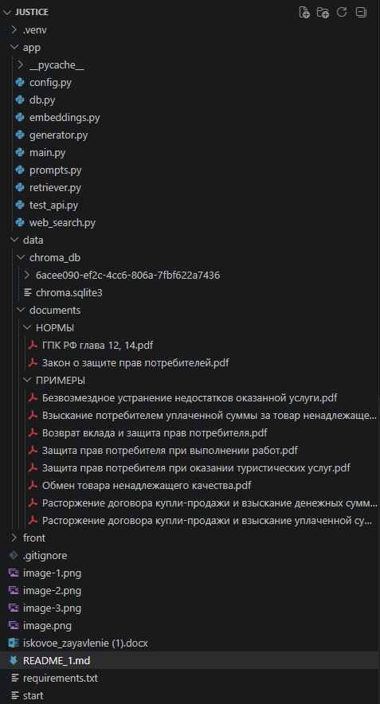
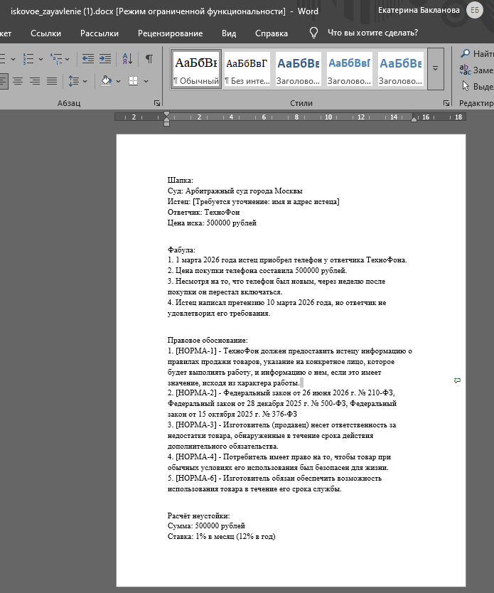
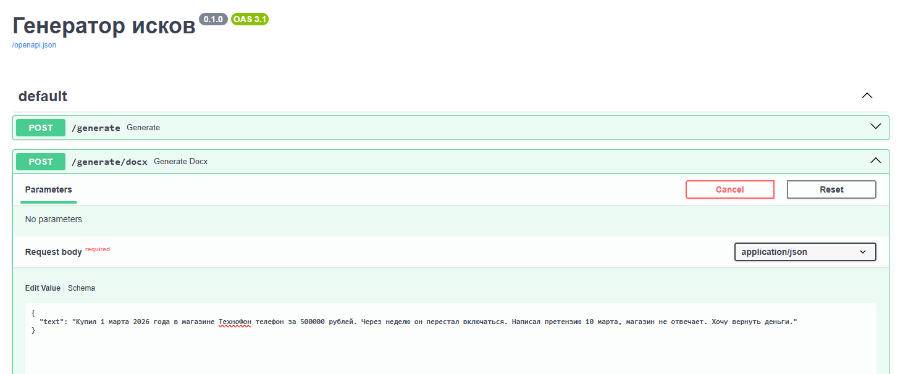
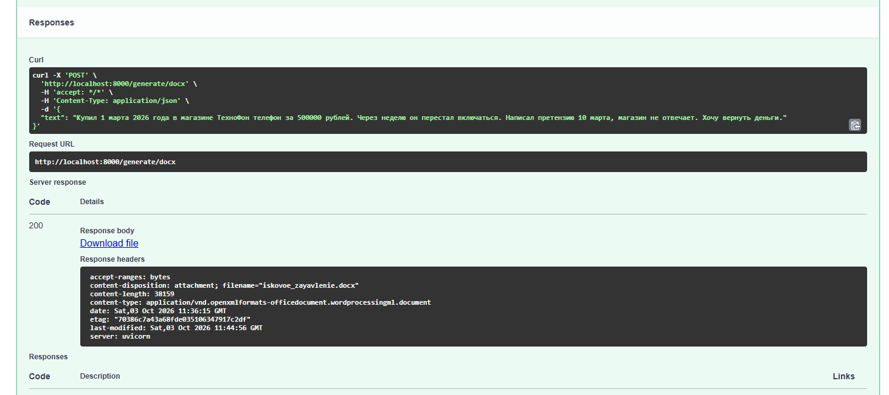
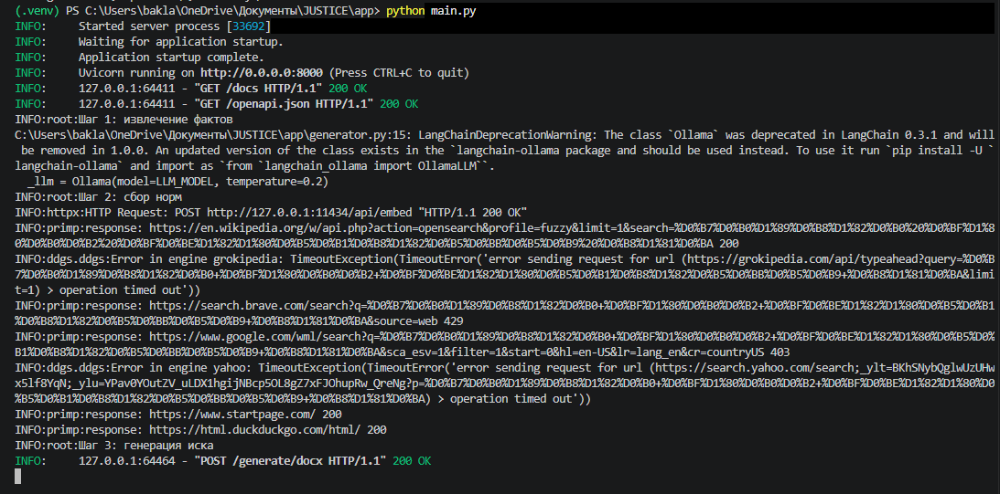

# JUSTICE - генератор исковых заявлений.
## ЭТАП 1

Проект представляет из себя систему для генерации исков по защите прав потребителей из неформального текста пользователя.

На данный момент создана основа проекта, работают основные эндпоинты генерации, сформирована векторная БД. После стабилизации базового пайплайна планируется настройка точности генерации и минимизация галлюцинаций путем сравнения различных вариантов эмбеддингов, моделей и их параметров. 

## Стек

- **Ollama** - локальная LLM (`mistral`) + эмбеддинги (`nomic`)
- **ChromaDB** - векторная база
- **LangChain** - пайплайн
- **FastAPI** - API-сервер
- **Docker** - контейнирезация
- **DDGS** - для поиска
- будет дополняться.

## Документы 

Делится на нормы и примеры исков ~74 страницы, будет дополняться.

## Стурктура проекта

ПРИМЕР генерации в файле iskovoe-zayavlenie (1).docx. Фрагмент генерации на скрине:

## Описание использования

Пользователь отправляет неформальный текст о нарушении своих прав через POST-запрос на эндпоинт /generate, /generate/docx или /generate/txt. На первом шаге mistral извлекает из этого текста структурированные факты: истца, ответчика, предмет договора, цену, дату нарушения и требования. На втором шаге эти факты используются для поиска релевантных правовых норм через сформированную векторную БД и поиск DDGS. На третьем шаге модель получает исходную фабулу, найденные нормы и системный промпт с требованиями к структуре иска. На основе этих данных генерируется готовый текст искового заявления с шапкой, фабулой, правовым обоснованием и пр. В зависимости от эндпоинта результат возвращается либо в виде JSON для отладки, либо в виде готового файла .docx/.txt.

# Запросы 

- POST /generate — принимает JSON {"text": "..."}. Возвращает JSON с полями facts (извлечённые факты), isk (текст иска), sources (использованные нормы). Для отладки.
- POST /generate/docx — принимает JSON {"text": "..."}. Возвращает файл iskovoe_zayavlenie.docx для скачивания.
- POST /generate/txt — принимает JSON {"text": "..."}. Возвращает файл iskovoe_zayavlenie.txt для скачивания.

Пример работы (Swagger):

- Запрос к generate/docx: 

- Ответ:

- Лог:

### * Исключены из репозитория:
Виртуальное окружение, кэш Python, векторная база, исходные PDF, секреты, логи.

--------------
Разработчик - Бакланова ЕС, ЭФМО-01-25
